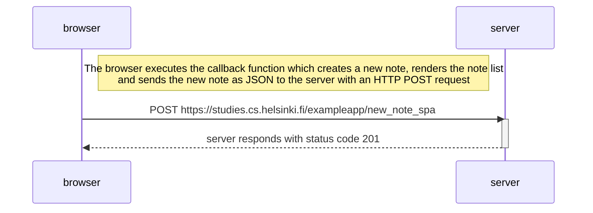

```mermaid
sequenceDiagram
    participant browser
    participant server

    Note right of browser: The browser executes the callback function which creates a new note, renders the note list <br> and sends the new note as JSON to the server with an HTTP POST request

    browser->>server: POST https://studies.cs.helsinki.fi/exampleapp/new_note_spa
    activate server
    server-->>browser: server responds with status code 201
    deactivate server
```